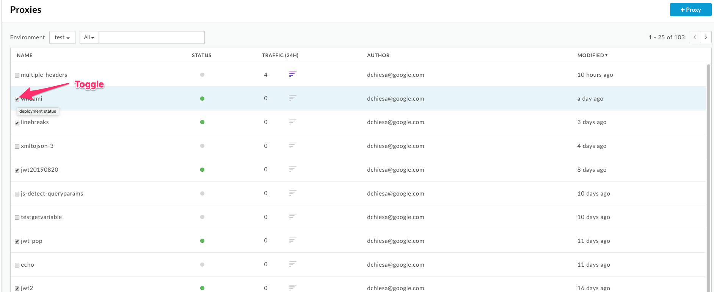
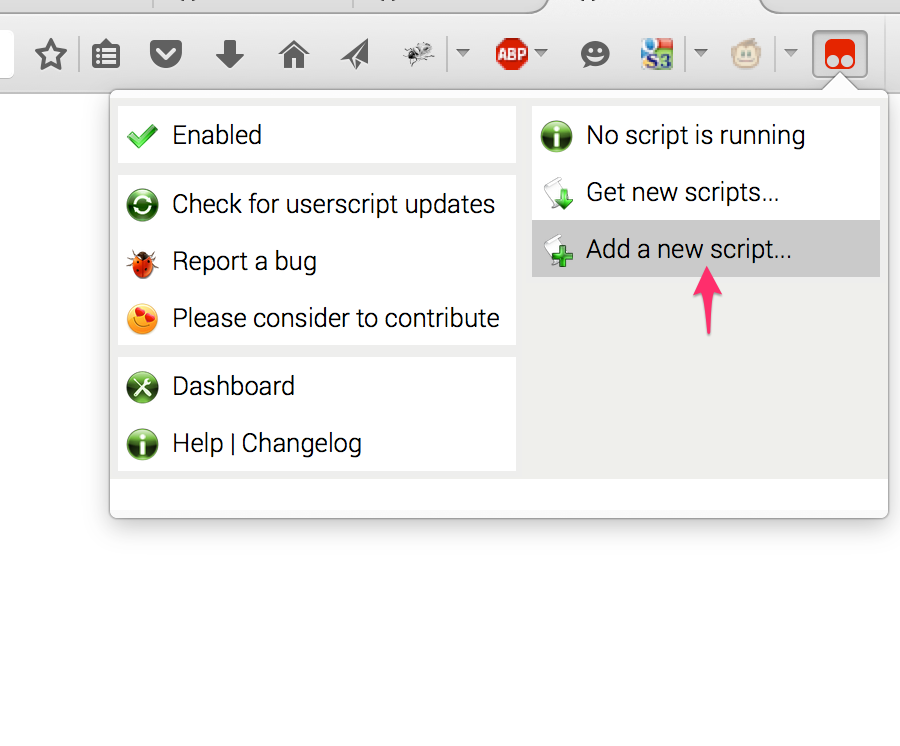

# Apigee Edge UE Tampermonkey script to Deploy and Undeploy from the Proxies List

This is a [Tampermonkey](https://tampermonkey.net/) script that tweaks
the [Apigee Edge](https://apigee.com) UI to allow the administrator to deploy and undeploy proxies from the proxies list.

## What is Tampermonkey?

Tampermonkey is a browser extension, that works on Firefox, Chrome, Safari, etc. It is a pre-requisite to get this tweak of the Edge UI.

Tampermonkey allows the running of "user scripts" on webpages from particular domains. It's a way of augmenting or modifying the behavior of a webpage, using code provided by or approved by the user. The modification could be as simple as changing the color or styling of a webpage; or it could be as complex as adding new behavior or UI elements on a web page, or even adding new pages.

The user must install the custom script, and associate it to a particular domain or set of domains. Thereafter, all pages loaded from those domains will run that "user script" after the browser page has loaded.

## How does this particular Tweak work?

This script registers for apigee.com . When it finds that the current page displays the proxies list, it
sets up a function to run on a timer. This function looks for rows in the table of proxies, and
adds a checkbox to each row. It also adds an event listener to each added checkbox.

> This checkbox-adder logic needs to run on a timer because with paging and filtering, the list of api proxies in the table may change.
Rows get added and removed. So periodically the logic re-runs.

When the state of the checkbox changes, the script deploys or undeploys the latest revision of the proxy to the currently selected environment.

## Installing the script

If you don't have Tampermonkey loaded for your browser, you must first visit  [tampermonkey.net](https://tampermonkey.net/) and install it.

Then,

1 Use the tampermonkey menu to add a new script.
  

2. copy-paste the [toggle-deploy-state-from-proxies-list.user.js](lib/toggle-deploy-state-from-proxies-list.user.js) script into place.

3. Reload the browser tab that is displaying the Proxies list.

4. Done.

## License

This user script is licensed under the [Apache 2.0 license](LICENSE).

## Compatibility

This user script works with Firefox, and Chrome on MacOS X.
It *ought to* work just fine on other combinations of browsers.

## Bugs

0. Sometimes the checkboxes do not appear. When that happens just reload the page.

1. Because of a race condition, the state of the checkbox can get unsynchronized with the state of the green dot, especially
   if you change the selected org in the dropdown.

2. There's no feedback presented when deploying or undeploying - no progress and no status on failure.

3. It's not clear it will work if you want to undeploy a revision of a proxy that is not the latest.

4. The current version has an unnecessary external dependency on
   waitForKeyElements(). It works fine, but it shouldn't be there, especially
   since there is a waitForPredicate() function which is nearly the same thing.

